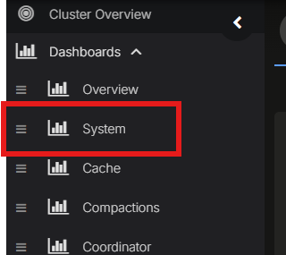
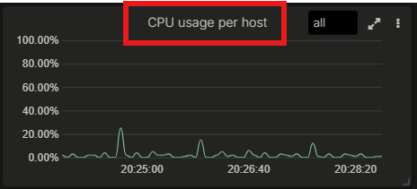
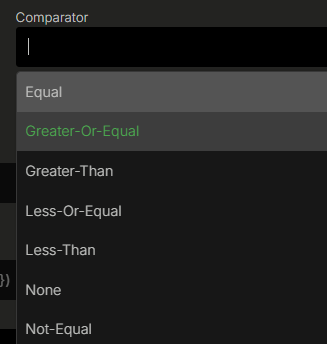
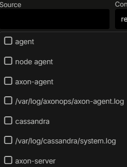

# axonops-config-automation

Tool to manage AxonOps settings

## Installation

### What You Will Need Before Start

To run the Ansible AxonOps Playbook you will need:

- Anisble >= 2.10
- Python3.8 or above

### Download The Repo

Clone this repo https://github.com/axonops/axonops-alerts

### Export Environment Variables

The Ansible Playbook takes as input environment variables, the standard for a SaaS connections are:

```shell
# export your org
# This is the only mandatory variable value
export AXONOPS_ORG='example'

# Create you API token within your AxonOps console. You will need DBA level access or above to the clusters
# you will be configuring.
export AXONOPS_TOKEN='aaaabbbbccccddddeeee'
```

To make the process easier the file `export_tokens.sh` was created with all the accepted variables.
Modify the file with your details and exports them with

```commandline
source ./export_tokens.sh
```

See the file itself for more details on the accepted environment variables

### Ansible preparation

The playbooks have been tested on Ansible 2.10 but it should work on most versions.

#### RedHat and RockyLinux

The system `ansible` package should work fine for RedHat and RockyLinux >=8

```sh
sudo dnf -y install epel-release
sudo dnf -y install ansible make
```

#### Debian and Ubuntu

It has been tested for Ubuntu 22.04 and Debian Bookworm:

```sh
sudo apt update
sudo apt -y install ansible make
```

#### Virtualenv

If you're using virtualenv, simply createa a python 3 environment and install Ansible to it:

```sh
virtualenv ~/py-axonops
source ~/py-axonops/bin/activate
pip3 install -r requirements.txt
```

#### pipenv

We recommend using `pipenv` to manage the environment. After installing `pipenv`, simply run:

```shell
pipenv install
```

and the export the variable:

```sh
export PIPENV=true
```

## Configuration

The configuration is structured in folders following the format within the directory `config`:

The `config/REPLACE_WITH_ORG_NAME` folder contains `alert_endpoints.yml` which defines alert endpoints at the org level,
since the alert endpoints are defined for the entire org and shared across all your clusters. All other
configurations are defined per cluster. This folder also contains the following files:

 - metric_alert_rules.yml
 - log_alert_rules.yml
 - service_checks.yml

These configurations defined in this folder will be applied to all of your clusters. You should define
common alert rules and service checks in this folder.

To define cluster specific configurations, overiding the rules and configurations defined at the org level, example
files are provided under `config/REPLACE_WITH_ORG_NAME/REPLACE_WITH_CLUSTER_NAME`. The rules and configurations
in this folder will append and override the settings provided in the org folder.


## Alert Endpoints
Alert endpoints such as Slack, Teams, PagerDuty, OpsGenie can be configured using this Ansible playbook.
Since alert enpoints configurations are AxonOps org-level setting, the configuration file is placed at `./config/<org_name>/alert_endpoints`.


## Metric Alert Rules
The metric alert rules are configured against the charts that exists for the AxonOps dashboard in each cluster.
Multiple alert rules can be configured against each chart.

An example configuration for a metric alert is shown below.

```
- name: CPU usage per host
  dashboard: System
  chart: CPU usage per host
  operator: '>='
  critical_value: 99
  warning_value: 90
  duration: 1h
  description: Detected High CPU usage
```
`name:` is the name of the alert

`dashboard:` must correspond to the dashboard name in the AxonOps right-hand menu.


`chart:` must correspond to the name of the chart within the above dashboard. In this case `CPU usage per host`. The metric query is
automatically detected by specifying the chart name.


`operator:` options are: `==`, `>=`, `>`, `<=`, `<`, `!=`


`critical_value:` is the critical value threshold

`warning_value:` is the warning value threshold

`duration:` is the duration the warning or critical values must violate the operator rule before the alert is triggered

`description:` sets the description of the alert. You may want to add a description of an action to take when this alert is raised

## Log Alert Rules
Currently the following matching syntax is supported
* `hello` - matches `hello`
* `hello world` - matches `hello` or `world`
* `"hello world"` - matches exact `hello world`

An example configuration for a log alert is shown below.
```
- name: TLS failed to handshake with peer
  warning_value: 50
  critical_value: 100
  duration: 5m
  content: \"Failed to handshake with peer\"
  source: "/var/log/cassandra/system.log"
  description: "Detected TLS handshake error with peer"
  present: true
```
`name:` is the name of the alert

`warning_value:` is the warning value threshold based on the count of matched logs

`critical_value:` is the critical value threshold based on the count of matched logs

`duration:` is the duration the warning or critical values must violate the operator rule before the alert is triggered

`content`: is the text search. Double quotes must be escaped

`source`: specifies the log source.


`description:` sets the description of the alert. You may want to add a description of an action to take when this alert is raised

## Service Checks
Service checks in AxonOps can be configured using this playbook. Example service check configurations can be found
in `./config/REPLACE_WITH_ORG_NAME/REPLACE_WITH_CLUSTER_NAME/service_checks.yml`


## Playbooks
The playbooks are designed to run in a predefined order as some of them depend on the others. For example,
you'll need to create the alert endpoints before you can set up alert routing.

1. Set up alert endpoints
2. Set up routes
3. Set up metrics alerts
4. Set up log alerts
5. Set up Service checks

### Running
The provided [Makefile](./Makefile) is the easiest way to run the playbooks:

```
❯ make help
metrics-alerts                 Create alerts based on metrics
check                          run pre-commit tests
endpoints                      Create alert endpoints and integrations
log-alerts                     Create alerts based on logs
routes                         Create alert routes
service-checks                 Create alerts for TCP and shell connections
```

You can dedide to either configure all the parameters as explained above using the [export_tokens.sh](./export_tokens.sh) file
or you can set them in the command line overriding the environment configuration:

```shell
make endpoints AXONOPS_ORG=ORG_NAME
make routes AXONOPS_ORG=ORG_NAME AXONOPS_CLUSTER=CLUSTER_NAME
make metrics-alerts AXONOPS_ORG=ORG_NAME AXONOPS_CLUSTER=CLUSTER_NAME
make log-alerts AXONOPS_ORG=ORG_NAME AXONOPS_CLUSTER=CLUSTER_NAME
make service-checks AXONOPS_ORG=ORG_NAME AXONOPS_CLUSTER=CLUSTER_NAME
```


### Other
The provided playbooks are only examples. Adapt the rules and configurations to suit your enterprise requirements.
